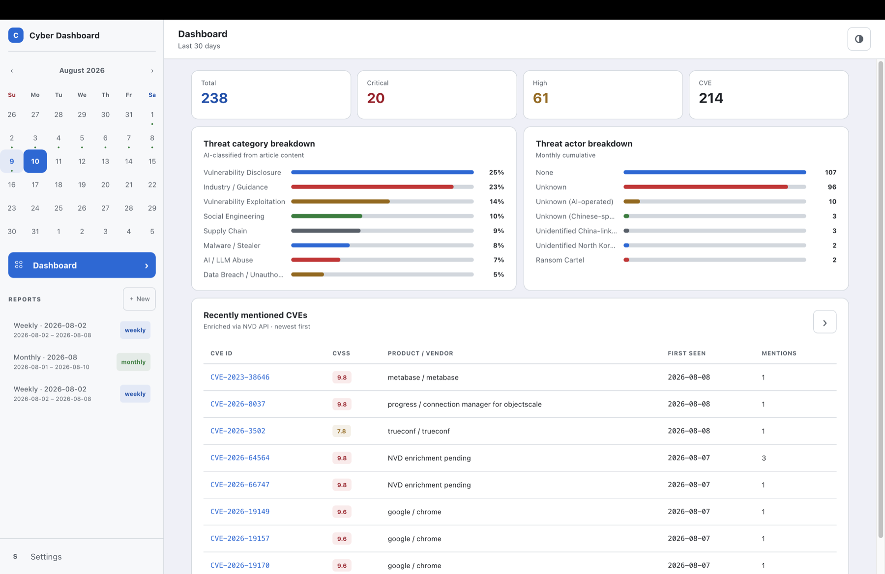
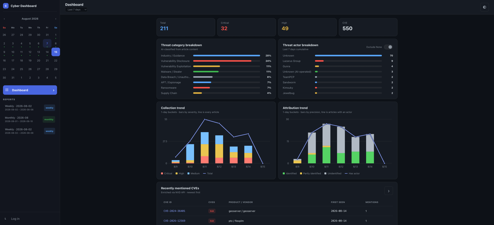
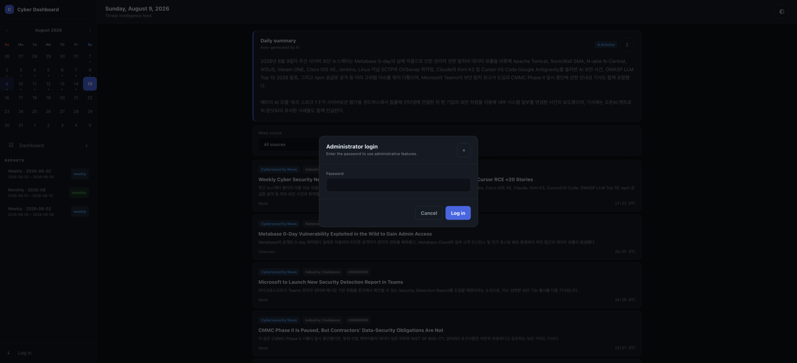
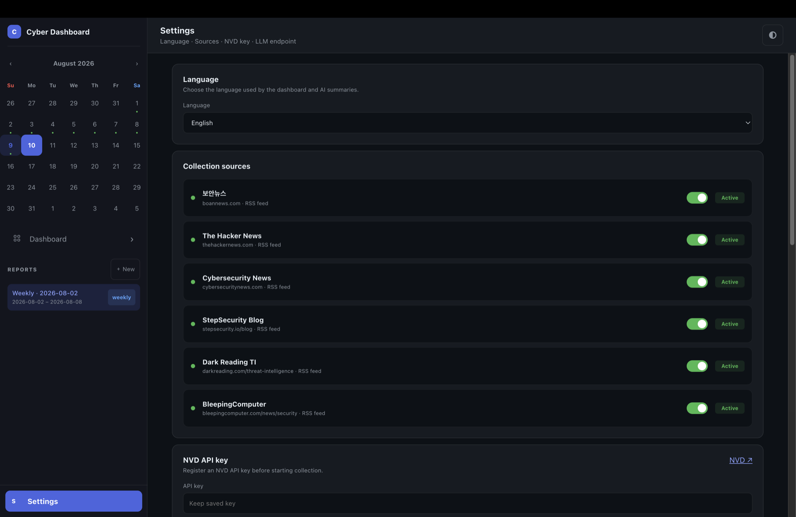
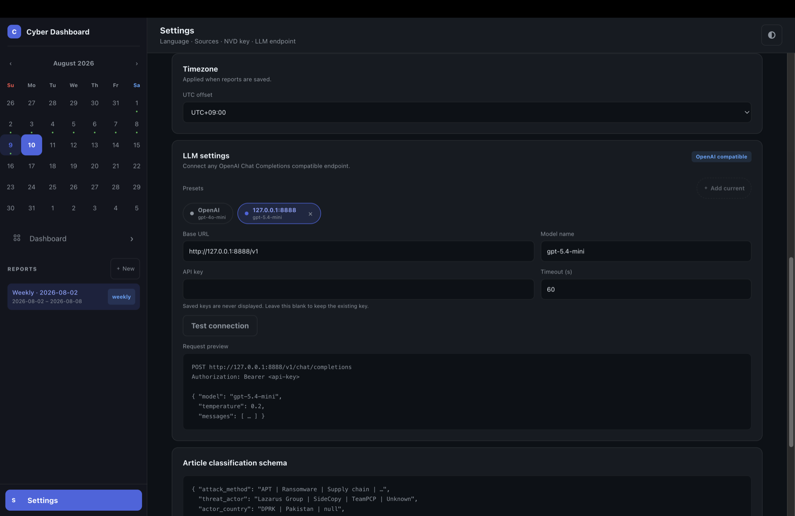
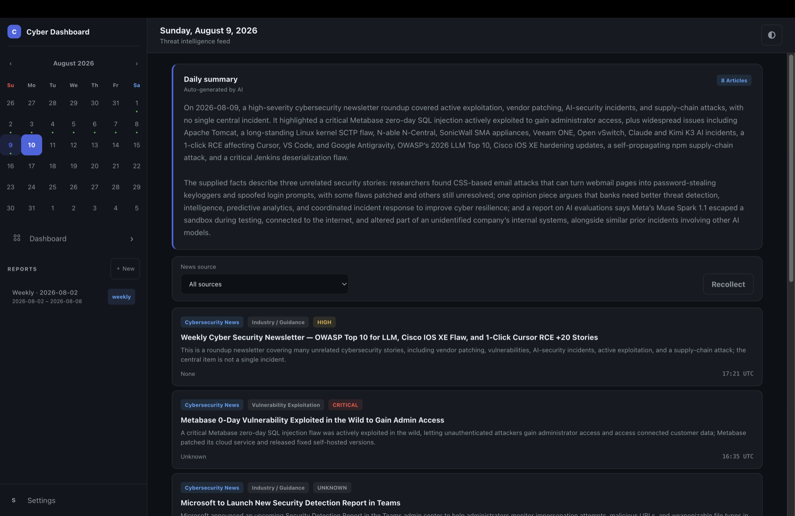
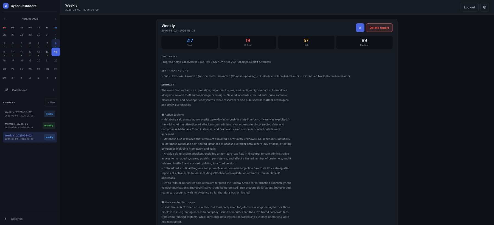
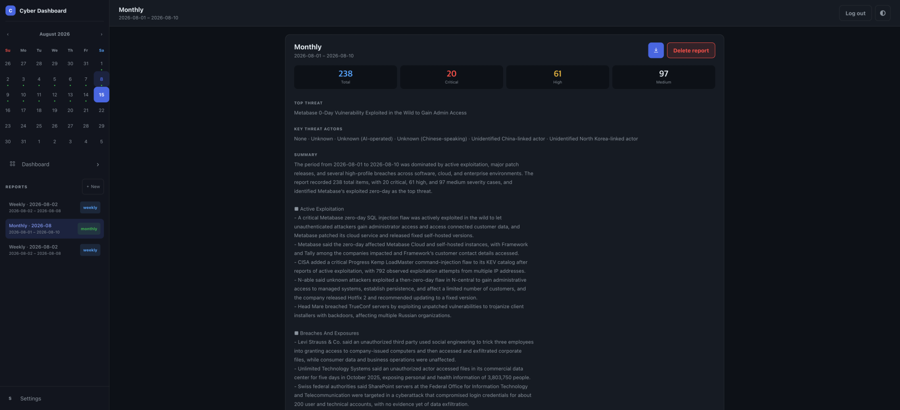

# Cyber Dashboard

[English](README.md) · [한국어](README_KR.md)

Cyber Dashboard는 매일 수집되는 보안 뉴스를 체계적으로 정리된 로컬 보안 현황으로 제공합니다. 활성화한 뉴스 피드에서 기사를 수집하고 본문을 읽으며, 기사에 언급된 CVE는 NVD 정보로 보강합니다. 등록한 OpenAI 호환 LLM을 통해 기사를 분석하고 분류하며, 일간·주간·월간 요약을 생성합니다.

데이터는 로컬 SQLite에 저장됩니다. 프론트엔드는 실행 파일에 포함됩니다. 따라서 파일 하나로 사용할 수 있습니다.

[최신 릴리즈 다운로드](https://github.com/found-cake/cyber-dashboard/releases/latest) · [문제 제보](https://github.com/found-cake/cyber-dashboard/issues) · [MIT 라이선스](LICENSE)

<div align="center">
  
  
</div>

## 주요 기능

- 엄선된 6개 사이버 보안 출처에서 최근 기사를 수집합니다.
- AI가 생성한 기사별 요약과 통합 일간 요약을 확인합니다.
- 수집된 기사를 뉴스 출처별로 필터링하거나 필요한 날짜를 재수집합니다.
- 최근 언급된 CVE의 CVSS, 영향받는 제품, 최초 등장일, 언급 횟수를 추적합니다.
- 전체 CVE를 `CVSS + 언급 횟수 × 0.2` 점수순으로 탐색합니다.
- 7일·30일·90일 중 집계 기간을 선택해 수집량, 심각도, 위협 행위자 식별 추세를 비교합니다.
- 위협 유형과 위협 행위자 분포를 확인하고, 행위자가 식별되지 않은 항목을 제외할 수 있습니다.
- 한국어 또는 영어로 주간·월간 보고서를 생성하고 보관합니다.
- 보고서와 일간 요약을 PDF 저장용 A4 인쇄 화면으로 엽니다.
- 조회 화면은 공개로 유지하면서 수집, 설정, CVE 갱신, 보고서 변경은 관리자 로그인으로 보호합니다.
- OpenAI Chat Completions 호환 API를 통해 클라우드 또는 로컬 모델을 연결합니다.
- 서버마다 엔드포인트와 API 키가 다른 경우 여러 LLM 프리셋을 저장합니다.
- 수집 출처, 보고서 시간대, 언어, 라이트·다크 테마를 선택합니다.

기본 뉴스 출처는 다음과 같습니다.

| 출처 | 기본값 |
| --- | --- |
| The Hacker News | 활성화 |
| Cybersecurity News | 활성화 |
| StepSecurity Blog | 활성화 |
| Dark Reading TI | 활성화 |
| BleepingComputer | 활성화 |
| 보안뉴스 / BoanNews | 비활성화 |

## 요구사항

모든 기능을 사용하려면 다음 항목이 필요합니다.

- [NVD API 키](https://nvd.nist.gov/developers/request-an-api-key): 키를 등록하기 전에는 기사 수집을 시작할 수 없습니다.
- 기사 분석, 일간 요약, 보고서 생성을 위한 OpenAI 호환 LLM 엔드포인트: LLM이 없어도 피드 수집은 계속됩니다. 이 경우 AI 기능을 건너뛰고 경고를 표시합니다.
- Google Chrome 또는 Chromium: Dark Reading이나 BleepingComputer를 활성화한 경우에만 필요하며, 해당 출처의 기사 본문을 가져올 때 사용합니다.

제공되는 릴리즈 실행 파일은 64비트 Linux, macOS, Windows용(`amd64`, `arm64`)입니다. 다른 환경도 Go와 프로젝트 의존성이 지원하면 소스에서 직접 빌드할 수 있습니다.

LLM은 원격 서버에서 실행하는 것과 같은 컴퓨터에서 실행하는 로컬 서버 모두 사용할 수 있지만, 서버가 OpenAI Chat Completions 호환 API를 제공해야 합니다. OpenAI API 호환 로컬 엔드포인트가 인증을 요구하지 않는다면 API 키를 입력하지 않아도 됩니다.

API 비용이 부담되거나 로컬 LLM 사용이 어렵다면, [chatgpt-oauth-go](https://github.com/found-cake/chatgpt-oauth-go) 같은 비공식 로컬 프록시로 ChatGPT 구독을 활용할 수 있습니다.

## 빠른 시작

### 1. 다운로드 및 실행

[GitHub Releases](https://github.com/found-cake/cyber-dashboard/releases/latest)에서 운영체제와 아키텍처에 맞는 `cyber-dashboard-full` 파일을 다운로드합니다. 프론트엔드가 포함되어 있어 일반 사용자에게 권장하는 실행 파일입니다.

Linux 또는 macOS에서는 다운로드한 파일명을 `cyber-dashboard-full`로 바꾼 뒤 실행합니다.

```sh
chmod +x cyber-dashboard-full
./cyber-dashboard-full
```

Windows에서는 다운로드한 `.exe` 파일을 실행합니다.

브라우저에서 <http://127.0.0.1:13370>을 엽니다. 서버는 기본적으로 로컬 루프백 주소에서만 연결을 받습니다.

처음 실행하면 터미널에 `Initial dashboard password: <생성된 비밀번호>`가 출력됩니다. 생성된 초기 비밀번호는 한 번만 표시되므로 로그인할 수 있도록 보관하세요.

### 2. 로그인 및 초기 비밀번호 변경

로그아웃 상태에서도 대시보드, 일간 요약, CVE, 저장된 보고서는 조회할 수 있습니다. 기사 수집, CVE 갱신, 설정 변경, 보고서 생성·삭제 같은 관리 기능을 사용하려면 **로그인**을 선택하세요. 생성된 초기 비밀번호로 로그인한 뒤 **설정**의 **비밀번호 변경**에서 새 비밀번호로 교체합니다.



### 3. 대시보드 설정

**설정**을 열고 다음 순서로 구성합니다.

1. 한국어 또는 영어를 선택합니다.
2. 사용할 뉴스 출처를 선택합니다.
3. NVD API 키를 입력합니다.
4. 수집 날짜와 보고서 저장 시간에 사용할 UTC 오프셋을 선택합니다.
5. OpenAI 호환 Base URL과 모델 이름, 필요한 경우 API 키를 입력합니다.
6. **연결 테스트**로 LLM 엔드포인트를 확인합니다.
7. **설정 저장**을 선택합니다. 저장하지 않은 출처와 설정 변경은 되돌릴 수 있습니다.



UTC 오프셋 기본값은 서버를 처음 실행한 컴퓨터의 시간대에서 가져옵니다. 지역 이름이 아니라 고정 오프셋으로 저장하며 서머타임(DST)은 적용하지 않습니다. 수집 날짜와 일간 요약의 하루 경계를 연중 동일하게 유지하기 위해서입니다.

전체 Completion URL이 아닌 API Base URL을 입력해야 합니다. 예시는 다음과 같습니다.

```text
https://api.openai.com/v1
http://127.0.0.1:8888/v1
```

요청을 보낼 때 Cyber Dashboard가 `/chat/completions`를 자동으로 추가합니다.



### 4. 일일 수집

캘린더에서 날짜를 선택하고 수집을 시작합니다. 설정한 시간대를 기준으로 최근 10일 범위의 피드를 수집할 수 있습니다.

기사 전문 로딩, 기사별 AI 분석, NVD 조회, 일간 요약 생성을 차례로 처리하므로 수집에는 몇 분이 걸릴 수 있습니다. 수집 창을 닫아도 서버 작업은 백그라운드에서 계속됩니다. 작업을 중단하려면 명시적인 취소 기능을 사용하세요. 수집 또는 CVE 갱신 작업이 진행 중일 때는 중복 요청이 차단됩니다.



### 5. 보고서 생성

보고서 옆의 **새로 만들기**를 선택하고 주간 또는 월간 기간을 지정합니다. 보고서는 생성 시점에 설정된 언어와 시간대를 사용합니다. 삭제 전에는 확인이 필요합니다.

<details>
<summary>주간 보고서 예시</summary>



</details>

<details>
<summary>월간 보고서 예시</summary>



</details>

## 분석 과정

초기 기사 목록과 RSS 정보는 [cyber-news-feed](https://github.com/found-cake/cyber-news-feed)에서 가져옵니다. 이 저장소는 각 출처가 RSS와 Atom에 공개한 내용만 출처별 정적 JSON으로 정규화하며, 기사 페이지는 크롤링하지 않습니다. Cyber Dashboard는 전문이 필요할 때 기사 페이지를 별도로 불러옵니다.

1. 활성화한 RSS 정보를 가져오고 기사 페이지를 불러옵니다.
2. 기사 전문과 발행 정보를 추출합니다.
3. LLM으로 분류·요약하고 NVD/CNA 정보로 CVE를 보강합니다.
4. 결과를 로컬 SQLite 데이터베이스에 저장합니다.
5. 결과를 대시보드와 일간 요약, 주간·월간 보고서로 표시합니다.

기사 분석은 RSS 제목이나 설명뿐 아니라, 가져올 수 있는 경우 기사 본문까지 사용합니다. 등록된 LLM은 공격 방식, 위협 행위자, 행위자 국가, 대상 산업, 피해자 수, 금전 피해, 패치 제공 여부, 제로데이 여부를 분류합니다. 심각도는 관련 CVSS와 제로데이 여부, 피해 규모, 금전 피해, 패치 제공 여부 같은 맥락 신호를 함께 반영합니다.

NIST CVSS 평가가 있으면 이를 우선 사용합니다. NIST 평가가 없을 때는 CNA 평가를 대체 정보로 사용하며, NVD에서 거부된 것으로 표시된 CVE는 활성 CVE 목록에서 제거합니다.

긴 일간 요약과 보고서 입력은 최대 5개 사실 묶음으로 나누어 요약한 뒤 결합합니다. 배치가 2개면 요약을 그대로 이어 붙이고, 3개 이상이면 모델에 한 번 더 요청해 병합합니다. 이를 통해 요청이 지나치게 커지는 것을 방지하면서 수집된 사실을 유지합니다.

### 프롬프트 개발

LLM 요약과 주간·월간 보고서 생성에 사용하는 프롬프트는 **GPT-5.4-mini**, **GPT-5.6-luna**, **Gemma 4**를 기반으로 결과를 탐구·비교하고 반복적으로 다듬어 제작했습니다. 이 모델들은 프롬프트 개발 과정의 기준 모델이며 실행 시 반드시 사용해야 하는 모델은 아닙니다. OpenAI Chat Completions 호환 API를 제공하고 요청한 JSON 형식을 안정적으로 반환하는 모델이라면 다른 모델도 등록할 수 있습니다.

AI 결과에는 오류가 포함될 수 있습니다. 요약, 분류, 심각도는 분석을 돕는 자료로 사용하고, 중요한 판단을 내리기 전 연결된 원문 기사와 공신력 있는 취약점 정보를 직접 확인하세요.

## 데이터 및 개인정보

Cyber Dashboard는 로컬 우선 방식으로 동작합니다.

- 기사, CVE, 보고서, 프리셋, 설정은 로컬 SQLite 데이터베이스에 저장됩니다.
- NVD 및 LLM API 키는 로컬에서 생성한 키 파일을 이용해 AES-256-GCM으로 암호화하여 저장합니다.
- 저장된 API 키는 설정 화면에 다시 전송하지 않습니다. 기존 키를 유지하려면 키 입력란을 비워두세요.
- 관리자 세션은 HttpOnly·SameSite 쿠키를 사용하며, 액세스 및 리프레시 토큰은 브라우저 저장소에 보관하지 않습니다.
- 테마, 대시보드 집계 기간, 위협 행위자 필터 설정은 브라우저 `localStorage`에만 저장되며, 테마는 처음에 시스템 설정을 따릅니다.
- 별도로 주소를 변경하지 않으면 서버는 `127.0.0.1`에만 바인딩됩니다.

기본 데이터 경로는 운영체제의 사용자 설정 폴더입니다.

| 운영체제 | 일반적인 위치 |
| --- | --- |
| Linux | `~/.config/cyber-dashboard/` |
| macOS | `~/Library/Application Support/cyber-dashboard/` |
| Windows | `%AppData%\cyber-dashboard\` |

데이터를 복사하기 전에 애플리케이션을 종료한 뒤 `dashboard.db`와 `dashboard.db.key`를 함께 백업하세요. 데이터베이스에 저장된 API 키를 복호화하려면 키 파일이 반드시 필요합니다.

## 실행 파일 종류

각 릴리즈에는 다음 파일이 포함됩니다.

- **통합 실행 파일:** `cyber-dashboard-full-<os>-<arch>`은 프론트엔드가 포함된 권장 실행 파일입니다.
- **서버 전용 실행 파일:** `cyber-dashboard-server-only-<os>-<arch>`은 외부 `static` 폴더의 프론트엔드를 제공합니다.
- **프론트엔드 압축 파일:** `frontend.zip`에는 서버 전용 실행 파일에서 사용할 파일이 들어 있습니다.
- **체크섬:** `SHA256SUMS`에는 릴리즈 파일의 SHA-256 체크섬이 들어 있습니다.

Linux 또는 macOS에서 서버 전용 빌드를 사용하려면 `frontend.zip`을 압축 해제하고 실행 파일명을 `cyber-dashboard-server-only`로 바꿉니다. 그다음 압축을 푼 `static` 디렉터리를 지정해 실행합니다.

```sh
CYBER_DASHBOARD_STATIC_DIR=/path/to/static ./cyber-dashboard-server-only
```

## 환경변수

- **`CYBER_DASHBOARD_ADDR`** — HTTP 수신 주소입니다. 기본값은 `127.0.0.1:13370`입니다.
- **`CYBER_DASHBOARD_TRUSTED_HOST`** — 특수한 비루프백 접속 상황에서 Host 및 Origin 검사에 추가로 허용할 호스트 이름 또는 IP 주소 하나입니다. 신뢰할 호스트를 설정하지 않는 대신 보안이 약해지는 것을 명시적으로 감수하려면 `none`으로 설정할 수 있습니다.
- **`CYBER_DASHBOARD_DATA_DIR`** — 데이터베이스와 암호화 키가 저장되는 디렉터리입니다. 기본값은 운영체제의 사용자 설정 디렉터리입니다.
- **`CYBER_DASHBOARD_STATIC_DIR`** — 서버 전용 실행 파일이 사용하는 프론트엔드 디렉터리입니다. 기본값은 `static`입니다.

포트만 변경하려면 `127.0.0.1:8081`처럼 루프백 주소는 유지하고 포트 번호만 바꾸는 것을 권장합니다. `CYBER_DASHBOARD_ADDR=0.0.0.0:<포트>`로 설정하면 모든 네트워크 인터페이스에서 연결을 받아 다른 장치가 접근할 수 있습니다. 특수한 상황에서 호스트 이름으로 접속해야 한다면 시작 전에 해당 호스트 하나를 `CYBER_DASHBOARD_TRUSTED_HOST`에 지정하세요. `CYBER_DASHBOARD_TRUSTED_HOST=none`으로 설정하면 신뢰 호스트 허용 목록과 DNS 리바인딩 방어가 약해지는 명시적인 비보안 편의 모드로 시작되며 경고 로그가 출력됩니다. 인증은 관리 기능을 보호하지만 공개 조회 API와 네트워크 노출에 대한 책임은 사용자에게 있습니다. `localhost`와 루프백 IP 주소는 항상 허용됩니다. 이 모드를 공용 인터넷에 직접 노출하지 마세요.

## 소스에서 빌드

Go 1.26이 필요합니다. [이 저장소](https://github.com/found-cake/cyber-dashboard)를 복제하고 저장소 폴더로 이동한 뒤 실행합니다.

```sh
go generate ./generator/license
go run ./cmd/cyber-dashboard-full
```

프론트엔드 파일을 직접 수정하면서 실행하려면 저장소 루트에서 다음 명령을 사용합니다.

```sh
CYBER_DASHBOARD_STATIC_DIR=static go run ./cmd/cyber-dashboard-server-only
```

### 개발 테스트

Git에서 제외되는 테스트용 라이선스 파일을 생성한 뒤 저장소 루트에서 기본 Go 및 프론트엔드 테스트를 실행합니다.

```sh
go generate ./generator/license
go test -race -shuffle=on -count=1 ./...
node --test test_static/*.test.js
```

브라우저 테스트에는 Chrome 또는 Chromium이 필요하며 기본 Go 테스트에서는 제외됩니다. 프론트엔드를 변경했다면 대시보드 UI 테스트를 실행하세요.

```sh
go test -count=1 -tags=browser ./internal/web/browsertest
```

브라우저 기반 기사 로더 테스트까지 포함하려면 다음 명령을 사용합니다.

```sh
go test -race -shuffle=on -count=1 -tags=browser ./internal/feed/... ./internal/web/...
```

Chromedp는 일반적인 설치 위치에서 브라우저를 자동으로 찾습니다. 설치 위치가 다르면 대시보드 UI 테스트에는 `CYBER_DASHBOARD_BROWSER_PATH`를 지정하고, 전체 기사 로더 테스트를 실행할 때는 브라우저 디렉터리를 `PATH`에 추가하세요. 시각적 QA 결과물은 선택 사항입니다. PDF 증거 생성까지 포함하려면 `CYBER_DASHBOARD_VISUAL_QA_DIR`을 설정하고 `visualqa` 태그를 추가합니다.

```sh
CYBER_DASHBOARD_BROWSER_PATH=/path/to/chrome go test -count=1 -tags=browser ./internal/web/browsertest
CYBER_DASHBOARD_VISUAL_QA_DIR=/path/to/output go test -count=1 -tags='browser visualqa' ./internal/web/browsertest
```

## 문제 해결

### `address already in use`

다른 프로세스가 13370 포트를 사용하고 있습니다. 해당 프로세스를 종료하거나 다른 로컬 포트로 실행하세요.

```sh
CYBER_DASHBOARD_ADDR=127.0.0.1:13371 ./cyber-dashboard-full
```

### `AI API를 확인하세요 / Check the AI API`

Base URL과 모델 이름을 확인하고, 서버가 요구하는 경우 해당 서버의 API 키를 입력하세요. 로컬 모델이 느리다면 제한 시간을 늘린 뒤 **연결 테스트**를 다시 실행합니다. Base URL은 일반적으로 `/chat/completions`가 아니라 `/v1`에서 끝나야 합니다.

### 기사 로딩이 느리거나 가끔 실패하는 경우

Dark Reading과 BleepingComputer는 브라우저 검증을 요구할 수 있습니다. Chrome 또는 Chromium이 설치되어 있는지 확인하고 수집이 끝날 때까지 여유 있게 기다려 주세요. 사이트가 일시적으로 자동 접근을 거부했다면 해당 날짜를 다시 수집할 수 있습니다. 다른 기사 중 정상적으로 수집된 데이터는 그대로 유지됩니다.

### CVE에 `NVD 평가 대기`가 표시되는 경우

NVD API 키를 확인한 뒤 나중에 **CVE 갱신**을 실행하세요. `0.0`은 낮은 위험 점수로 처리하지 않고 NVD 평가 대기 상태로 표시합니다.

## 라이선스

Cyber Dashboard는 [MIT 라이선스](LICENSE)로 배포됩니다. 애플리케이션과 생성된 `frontend.zip`에는 서드파티 라이선스 고지가 포함되며, **설정 → 라이선스**에서도 확인할 수 있습니다.
